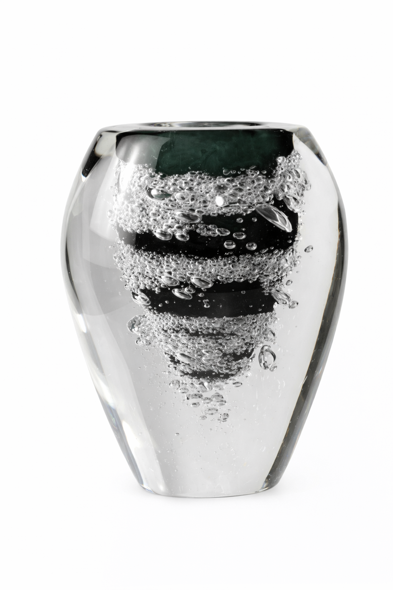
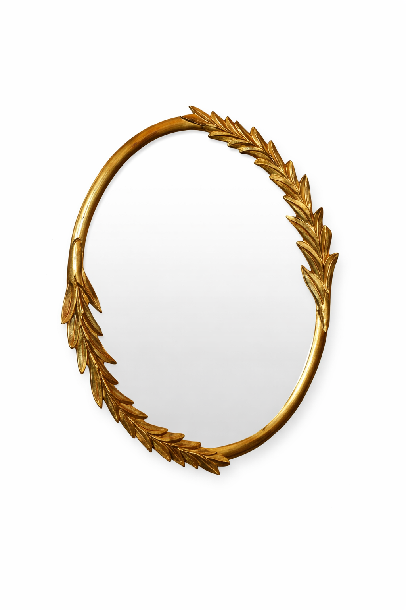

# 📍 Руководство по настройке интерактивных карт

## Как добавить новую интерактивную карту

### 1. Подготовьте изображение
- Разместите изображение в папке `imgs/cataloge/`
- Например: `imgs/cataloge/мягкая мебель общ1э.png`

### 2. Добавьте секцию карты в `catalog.html`

Найдите секцию с классом `.interactive-catalog-map` и скопируйте её структуру:

```html
<!-- Interactive Catalog Map -->
<section class="interactive-catalog-map">
    <div class="container">
        <div class="interactive-map-wrapper">
            <!-- ЗАМЕНИТЕ НА ВАШЕ ИЗОБРАЖЕНИЕ -->
            
            
            <!-- Здесь добавляйте точки (см. ниже) -->
        </div>
    </div>
</section>
```

## Как добавить точку (hotspot)

### Структура точки:

```html
<div class="hotspot" data-category="КАТЕГОРИЯ" style="top: Y%; left: X%;">
    <div class="hotspot-pulse"></div>
    <div class="hotspot-preview">
        <div class="hotspot-preview-image">
            
        </div>
        <div class="hotspot-preview-content">
            <div class="hotspot-preview-title" data-translate="КЛЮЧ-ПЕРЕВОДА">Название категории</div>
            <div class="hotspot-preview-action">
                <span data-translate="view-all">Посмотреть все</span>
                <i class="fas fa-arrow-right"></i>
            </div>
        </div>
    </div>
</div>
```

### Параметры для настройки:

#### 1. **data-category** - категория товаров
Должна совпадать с категорией в `js/catalog.js`:
- `chairs` - стулья
- `sofas` - диваны
- `armchairs` - кресла
- `bar-stools` - барные стулья
- `dining-tables` - обеденные столы
- `coffee-tables` - кофейные столы
- и т.д.

#### 2. **style="top: Y%; left: X%"** - позиция точки
- `top` - расстояние от верха (0-100%)
- `left` - расстояние от левого края (0-100%)

**Как найти правильные координаты:**
1. Откройте изображение в браузере
2. Используйте инструменты разработчика (F12)
3. Наведите на нужное место и смотрите координаты
4. Или методом проб: начните с `top: 50%; left: 50%` и корректируйте

#### 3. **src="imgs/cataloge/..."** - превью товара
Путь к изображению товара, которое будет показываться в карточке

#### 4. **data-translate** - ключ для перевода
Используется для мультиязычности (если настроена)

## Примеры позиций точек

```
Верхний левый угол:     top: 10%; left: 10%
Верхний правый угол:    top: 10%; left: 90%
Центр:                  top: 50%; left: 50%
Нижний левый угол:      top: 90%; left: 10%
Нижний правый угол:     top: 90%; left: 90%
```

## Полный пример: Добавление новой карты "Декор"

```html
<!-- Interactive Catalog Map - Декор -->
<section class="interactive-catalog-map">
    <div class="container">
        <div class="interactive-map-wrapper">
            
            
            <!-- Точка для ваз -->
            <div class="hotspot" data-category="vases" style="top: 30%; left: 25%;">
                <div class="hotspot-pulse"></div>
                <div class="hotspot-preview">
                    <div class="hotspot-preview-image">
                        
                    </div>
                    <div class="hotspot-preview-content">
                        <div class="hotspot-preview-title">Вазы</div>
                        <div class="hotspot-preview-action">
                            <span>Посмотреть все</span>
                            <i class="fas fa-arrow-right"></i>
                        </div>
                    </div>
                </div>
            </div>
            
            <!-- Точка для зеркал -->
            <div class="hotspot" data-category="mirrors" style="top: 60%; left: 70%;">
                <div class="hotspot-pulse"></div>
                <div class="hotspot-preview">
                    <div class="hotspot-preview-image">
                        
                    </div>
                    <div class="hotspot-preview-content">
                        <div class="hotspot-preview-title">Зеркала</div>
                        <div class="hotspot-preview-action">
                            <span>Посмотреть все</span>
                            <i class="fas fa-arrow-right"></i>
                        </div>
                    </div>
                </div>
            </div>
        </div>
    </div>
</section>
```

## Советы по размещению точек

1. **Не размещайте точки слишком близко к краям** - карточка может выйти за границы
2. **Оптимальные отступы от краёв**: минимум 15% от каждого края
3. **Расстояние между точками**: минимум 10-15% чтобы карточки не перекрывались
4. **Размещайте точки на пустых местах** изображения, не на самих предметах

## Где находятся файлы

- **HTML структура**: `catalog.html` (строки ~130-180)
- **CSS стили**: `style/catalog.css` (секция "Interactive Catalog Map")
- **JavaScript логика**: `js/catalog.js` (секция "INTERACTIVE HOTSPOTS")
- **Изображения**: `imgs/cataloge/`

## Быстрый чеклист

- [ ] Изображение карты добавлено в `imgs/cataloge/`
- [ ] Секция `.interactive-catalog-map` добавлена в HTML
- [ ] Путь к изображению указан правильно
- [ ] Точки добавлены с правильными `data-category`
- [ ] Координаты `top` и `left` настроены
- [ ] Превью изображения для каждой точки указано
- [ ] Категории существуют в `js/catalog.js`
- [ ] Проверено в браузере

## Troubleshooting

**Точка не открывает галерею:**
- Проверьте что `data-category` совпадает с категорией в `products` массиве
- Убедитесь что в категории есть товары

**Карточка обрезается:**
- Увеличьте отступ точки от края (минимум 15%)
- Или уменьшите размер карточки в CSS

**Точка в неправильном месте:**
- Корректируйте `top` и `left` значения по 5% за раз
- Используйте инструменты разработчика для точной настройки
